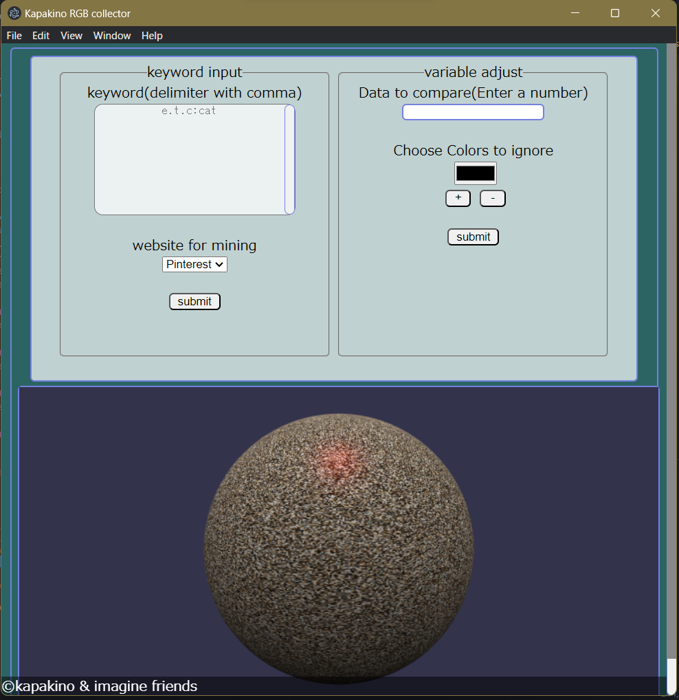

<h1>Description:</h1> 
    
This program will scramp the website and fetch the pictures rgb value by given keyword, the result will be shown in visualize and also in the text form.
 
<h1>How to Install:</h1> 
    <strong>Windows</strong> 
        
Click on the bat file, follow the instruction and it should be fined.
 
    <strong>Linux</strong> 
        
Click on the sh file, follow the instruction and it should be fined.
 
    <strong>MacOS</strong> 
        
Do I really need to provide a cmd file to the top programmer?
 
<h1>Interface Preview:</h1> 

Enter the keyword and choice the web that you want to scramp.
 

(In this version only provide Pinterest.)
 
<h1>Author Info:</h1> 
    
Hello! I'm kapakino. I'm interested in web development and also operating system design or control system design.
 
    
you can come check out my leetcode:
(https://leetcode.com/kapakino/) 
